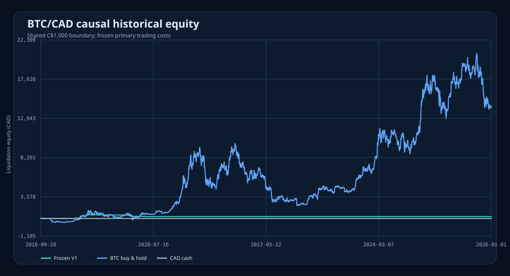
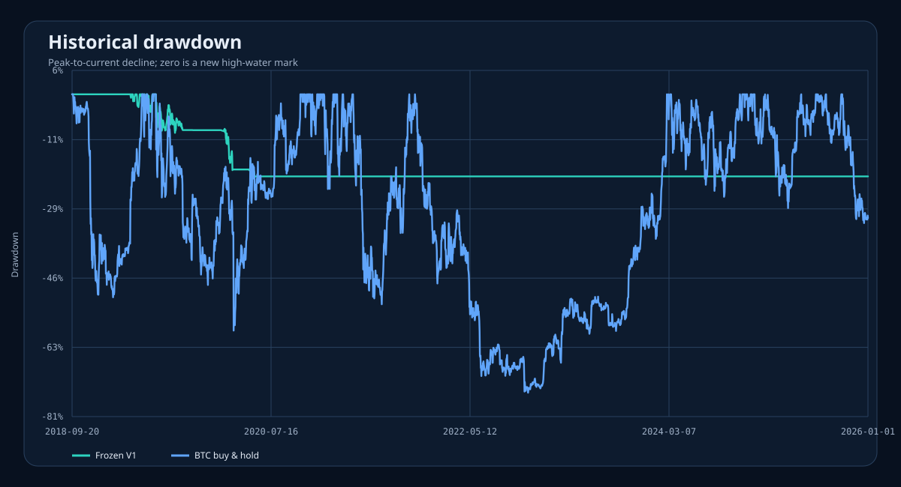
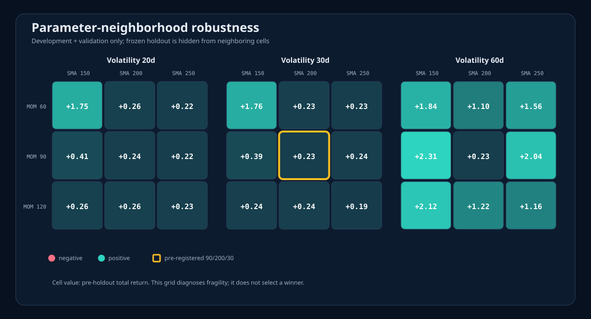

# BTC/CAD V1 historical result

This is the first sealed result for Kraken Knight's frozen 90/200/30
momentum, trend, and volatility-sizing strategy. It was generated once from
clean commit `e22985ec83f3104736f31d5818aa5f1acda39b51` using 4,630,185 official
Kraken BTC/CAD trades and an exclusive 2026-01-01 data cutoff.

## Bottom line

The replay is engineering-valid, but it does **not** establish that V1 is
profitable out of sample. V1 grew C$1,000 to C$1,225.27 before and during its
development period, hit the frozen 20% drawdown circuit breaker in May 2020,
liquidated, and then correctly remained disarmed because V1 has no automatic
rearm. It consequently made no trades and earned 0% during both validation and
the 532-day holdout.

| Replay | Period | Final equity | Return | CAGR | Sharpe | Maximum drawdown |
| --- | --- | ---: | ---: | ---: | ---: | ---: |
| Frozen V1 | Full evaluation | C$1,225.27 | +22.53% | +2.83% | 0.39 | -20.83% |
| Frozen V1 | Holdout | C$1,225.27 | 0.00% | 0.00% | undefined | 0.00% |
| Fee-aware BTC hold | Full evaluation | C$14,286.86 | +1,328.69% | +44.04% | 0.90 | -74.67% |
| Fee-aware BTC hold | Holdout | C$14,286.86 | +36.63% | +23.88% | 0.71 | -32.22% |
| CAD cash | Full evaluation | C$1,000.00 | 0.00% | 0.00% | undefined | 0.00% |

The buy-and-hold row is a return comparator, not a like-for-like risk target:
it remained almost fully exposed and endured a 74.67% historical drawdown.

## Why V1 stopped

- The strategy reached a 20.25% high-water-mark drawdown on 2020-05-21.
- The 10% execution-minute participation rule required three causal sell fills,
  completing liquidation on 2020-05-23.
- The final account value was C$1,225.27.
- The persistent disarm then produced 1,853 `no_action_disarmed` decisions,
  including every one of the 532 holdout days.
- Full-period costs were C$47.12 in fees and C$5.91 in modeled adverse
  slippage across 56 fills.
- Average BTC exposure was only 3.04%; the longest drawdown duration was 2,380
  days because the disarmed portfolio never regained its earlier high-water
  mark.

This behavior is faithful to the risk policy. It also means the frozen holdout
is uninformative about the signal's post-2020 profitability: it tests the
no-auto-rearm policy and observes cash, not a market-exposed strategy.

## Robustness, without selecting a winner

All 27 neighboring parameter combinations were positive on development plus
validation, but returns ranged from +19.16% to +230.65%. The selected 90/200/30
point returned +22.53% and was not replaced. The wide range is a fragility
warning, especially because different windows encounter the persistent
drawdown gate on different paths.

Non-primary cost cases were also restricted to pre-holdout data. They remained
positive from +21.86% under doubled primary costs to +25.17% under the
maker/maker assumption, but this does not repair the zero-exposure holdout.

## Visual evidence

## Interpretation and next experiment

Engineering confidence is high: source identity, causal timing, missing
minutes, current Kraken rules, fees, slippage, volume participation, split
isolation, and every output checksum are enforced and tested.

Profitability confidence is low: V1 has no exposed holdout evidence. This result
should not unlock paper or live trading. The next separately pre-registered
study should define an explicit operator rearm policy or a fresh-account
walk-forward boundary, then evaluate it without changing this immutable result.

The complete published bundle includes the exact
[report](../reports/published/btc-cad-v1-2026-01-01-e22985e/report.md),
[metrics](../reports/published/btc-cad-v1-2026-01-01-e22985e/metrics.csv),
[risk events](../reports/published/btc-cad-v1-2026-01-01-e22985e/risk_events.csv),
[fills](../reports/published/btc-cad-v1-2026-01-01-e22985e/fills.csv), and
[checksums](../reports/published/btc-cad-v1-2026-01-01-e22985e/checksums.sha256).
