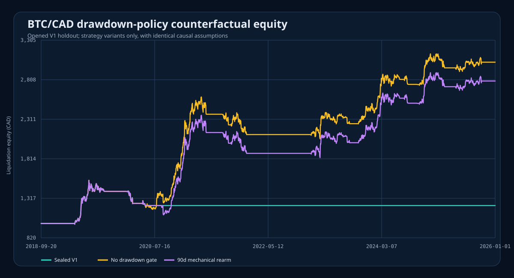
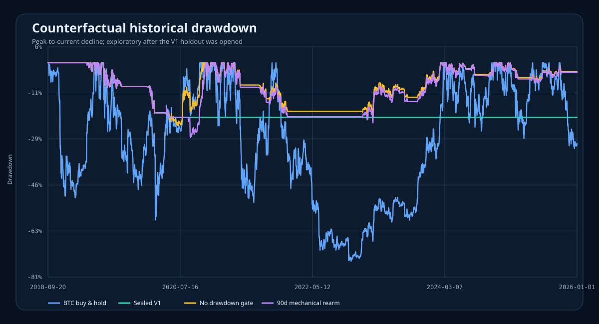
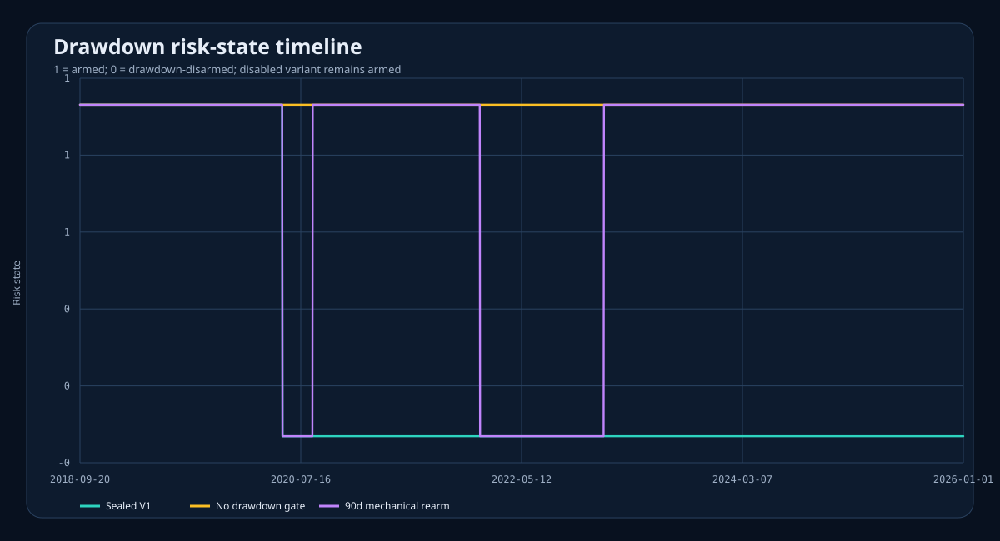
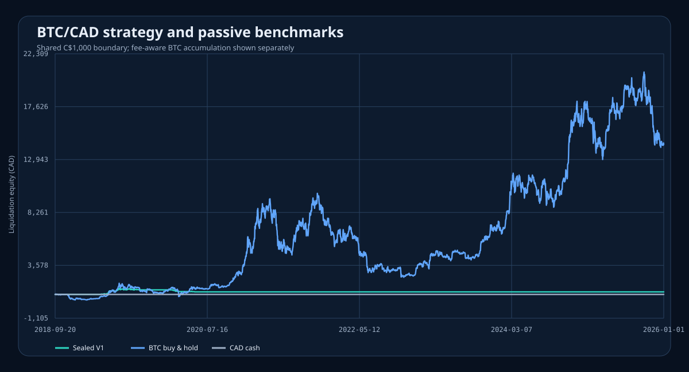

# BTC/CAD V2 drawdown counterfactual result

This is the sealed follow-up to the V1 result that remained in cash after May
2020. It compares the unchanged 90/200/30 signal under two separately labelled
drawdown-policy counterfactuals:

- no high-water drawdown gate; and
- the original 20% liquidation followed by a 90-calendar-day cooldown and the
  next causal long signal.

The run used clean commit `0943d7bf84321886a9956b105bcb8cfff81dd61b` and
pre-registration SHA-256
`2c10774480b2c2fcf056a5227b2df1d1875cc621b05afd18408bd1f9d92204f9`.
The runner first reproduced the published V1 equity, decisions, fills, risk
events, and fee-aware buy-and-hold records exactly. It then ran each
counterfactual once, without tuning.

## Bottom line

The flat post-2020 V1 curve was caused by the persistent latch, not by an
inactive signal or a broken chart. Once the latch is removed or mechanically
rearmed, the strategy resumes trading and produces positive historical P&L.
After the final forced sale, sealed V1 still recorded 1,220 `long_signal`
decisions through the cutoff, but zero positive target-weight decisions; 1,853
post-liquidation decisions resolved as `no_action_disarmed`. This directly
confirms that the latch suppressed entries while the signal remained active.

| Historical path | Final equity | Total return | CAGR | Sharpe | Maximum drawdown | Average BTC exposure | Actual fills |
| --- | ---: | ---: | ---: | ---: | ---: | ---: | ---: |
| Sealed V1 persistent disarm | C$1,225.27 | +22.53% | +2.83% | 0.39 | -20.83% | 3.04% | 56 |
| No drawdown gate | C$3,028.90 | +202.89% | +16.42% | 1.11 | -23.65% | 18.20% | 358 |
| Mechanical 90-day trend rearm | C$2,792.13 | +179.21% | +15.13% | 1.02 | -28.11% | 17.54% | 348 |
| Fee-aware BTC buy and hold | C$14,286.86 | +1,328.69% | +44.04% | 0.90 | -74.67% | 99.98% | 2 entry fills* |
| CAD cash | C$1,000.00 | 0.00% | 0.00% | undefined | 0.00% | 0.00% | 0 |

\*The benchmark metric counts its two causal entry fills plus a modeled terminal
liquidation for cost attribution. The actual entry log contains two fills.

The no-gate variant is the stronger of the two exploratory strategy paths on
this dataset: it finishes C$236.77 above mechanical rearm, with a higher Sharpe
and a lower maximum drawdown. That is a descriptive result, not an independent
selection result.

Buy and hold still dominates absolute wealth. Its return is not a like-for-like
risk comparison: it remains almost fully exposed and suffers a 74.67% maximum
drawdown. The no-gate strategy's lower return comes with much less exposure and
a 23.65% maximum drawdown. Its higher historical Sharpe therefore says that the
cash-heavy path was smoother per unit of observed volatility; it does not say
that it created more dollars than holding BTC.

## The previously frozen segment

The old holdout was already opened before V2 was specified, so it is renamed
`opened_v1_holdout` and remains exploratory.

| Path | 2024-07-18 equity | 2025-12-31 equity | Segment return | Segment CAGR | Maximum drawdown |
| --- | ---: | ---: | ---: | ---: | ---: |
| Sealed V1 | C$1,225.27 | C$1,225.27 | 0.00% | 0.00% | 0.00% |
| No drawdown gate | C$2,810.83 | C$3,028.90 | +7.76% | +5.26% | -7.11% |
| Mechanical rearm | C$2,574.06 | C$2,792.13 | +8.47% | +5.74% | -7.69% |
| BTC buy and hold | C$10,456.89 | C$14,286.86 | +36.63% | +23.88% | -32.22% |

Both strategy variants earn the same C$218.07 during this segment and execute
the same 60 economic fills. Their percentage returns differ only because they
enter with different equity. The frozen C$800 absolute BTC cap makes their
positions identical once both are in cash and receive the same next signal;
the mechanical path permanently carries its earlier C$236.77 opportunity-cost
gap.

## What mechanical rearm did

The mechanical variant records two complete risk cycles:

1. disarm on 2020-05-21, then rearm on 2020-08-20 after the 90-day boundary and
   a qualifying long signal; and
2. disarm on 2022-01-06, become time-eligible on 2022-04-06, then wait in cash
   until the next qualifying long signal on 2023-01-14.

Its maximum drawdown exceeds the 20% trigger because the trigger is an action
threshold, not a guaranteed loss floor, and the full-history drawdown series
does not reset when a new risk epoch begins. The continuous drawdown starts at
the C$1,542.05 equity peak on 2019-06-27. The first liquidation ends near
C$1,225.27; after the August 2020 rearm, equity falls further to C$1,108.53 on
2020-09-06, producing the reported 28.11% peak-to-trough drawdown.

## Visual evidence

## Interpretation

Engineering confidence is high. The bundle is bound to clean code, an exact
pre-registration, the same normalized Kraken data and manifest, the published
V1 checksums, causal post-decision VWAPs, fees, slippage, exchange minimums, and
the 10% volume-participation cap. All artifact checksums verify.

Profitability confidence is still limited. V2 was motivated by observing V1's
failure mode, and therefore has no fresh holdout. It shows that the underlying
signal historically functioned and that the permanent latch was the reason for
the flat curve. It does not establish future profitability or authorize paper
or live trading. Independent evidence must come from data after the frozen
2026-01-01 cutoff or a forward paper or micro-live observation.

The complete published bundle includes the exact
[report](../reports/published/btc-cad-v2-drawdown-counterfactual-2026-01-01-0943d7b/report.md),
[metrics](../reports/published/btc-cad-v2-drawdown-counterfactual-2026-01-01-0943d7b/metrics.csv),
[pairwise deltas](../reports/published/btc-cad-v2-drawdown-counterfactual-2026-01-01-0943d7b/pairwise_deltas.csv),
[risk events](../reports/published/btc-cad-v2-drawdown-counterfactual-2026-01-01-0943d7b/risk_events.csv),
[fills](../reports/published/btc-cad-v2-drawdown-counterfactual-2026-01-01-0943d7b/fills.csv),
[manifest](../reports/published/btc-cad-v2-drawdown-counterfactual-2026-01-01-0943d7b/manifest.json),
and [checksums](../reports/published/btc-cad-v2-drawdown-counterfactual-2026-01-01-0943d7b/checksums.sha256).
